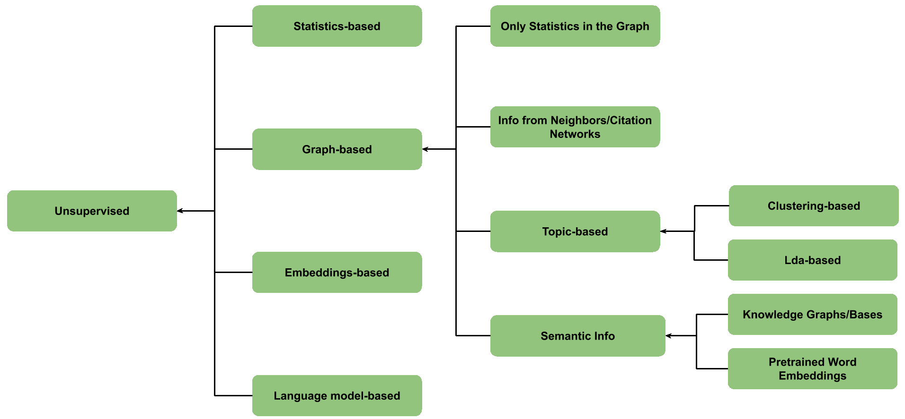

# NLP: Keyword Extraction
An archive of keyword extraction methods in NLP

The keyword extraction methods can be classified based on different approaches. 

Many methods can be included in multiple categories. The categories and the methods included in each category are given below. I have tried to make the list as comprehensive as possible and is continuously updated. 
## Keyword Extraction Methods
### Statistics-based Methods
- Term Frequency - Inverse Document Frequency (TF-IDF)
- KP-Minor
- KeyCluster
- Yet Another Keyword Extractor (YAKE)

### Graph-based (Ranking) Methods 
- TextRank
- SingleRank
- Rapid Automatic Keyword Extraction (RAKE)
- PositionRank (PR)
#### Citation Network-based Methods
- ExpandRank
- CiteTextRank

#### Topic-based Methods
- Clustering-based Methods
  - TopicRank
  - MultipartiteRank
- LDA-based Methods
  - Topical PageRank
  - Single Topical PageRank
  - Salience Rank

#### Graph-based Methods with Semantics
- Semantics from Knowledge Graphs/Bases
  - WikiRank
- Semantics from PretrainedWord Embeddings
  - Key2Vec

### Embeddings-based Methods
- EmbedRank
- Reference Vector Algorithm (RVA)
  
### Language Model-based Methods
#### Supervised Methods
- Traditional Methods
  - Keyphrase Extraction as Binary Classification Task
    - KEA
    - WINGNUS
    - CeKE
    - PCU-ICL
    - SurfKE
  - Keyphrase Extraction as Learning to Rank Task
    - Ranking SVM
    - MIKE
  - Keyphrase Extraction Using Supervision
    - TopicCoRank
  - Sequential Labeling
- Deep Learning-based Methods
  - RNN-based Models
  - seq2seq
  - CorrRNN
  - Topic-based Adversarial Neural Network (TANN)
  - Bi-LSTM RNN
  - KeyBERT

#### Unsupervised Methods

## References
1. Papagiannopoulou, E., & Tsoumakas, G. (2020). A review of keyphrase extraction. Wiley Interdisciplinary Reviews: Data Mining and Knowledge Discovery, 10(2), e1339.